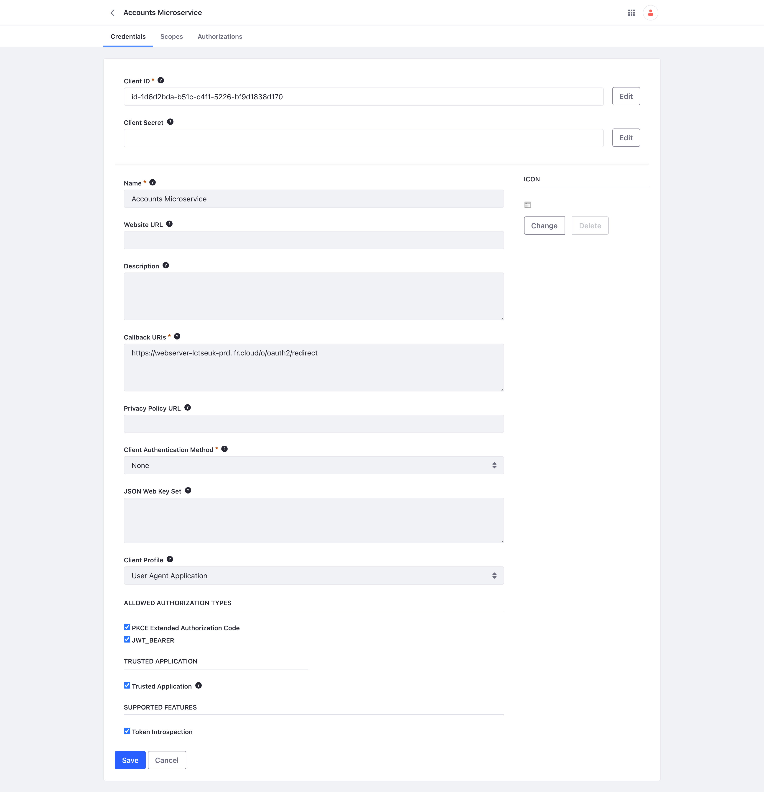

# Liferay Spring Boot Microservice Example
An example of how a Spring Boot Microservice can trust Liferay as an OAuth 2.0 Aithorisation Server and make use of the Liferay headless API using the provided JWT token.

It is based on Fabian Bouché's [Spring Boot Resource Server](https://github.com/fabian-bouche-liferay/spring-boot-sample) example.

## Usage
### Liferay Experience Cloud
This project can be added as a custom service to a Self Managed Liferay Experience Cloud (LXC SM) environnment.

See how the LCP.json and Dockerfile for more information on the configuration of the deployed custom service.

### Local
It can run locally using `mvn spring-boot:run `

## OAuth 2.0 Configuration
To make this example work you need to create an entry in Liferay's OAuth 2 Adminstration configuration.

### Create OAuth 2 Administration Entry

This is done from the OAuth 2 Administration page of the Control Panel section of the Global Menu.

Field | Value
--- | ---
Name | This value should be meaningful but is not used
Website URL | This should be left blank
Callback URIs | This needs to be the OAuth 2 redirect endpoint for your Liferay instance. https://<liferay host>/o/oauth2/redirect
Privacy Policy URL | This should be left blank
Client Authentication Method | None
JSON Web Key Set | This should be left blank
Client Profile | User Agent Application
PCKE Extended Authoirzation Code | Checked
JWT_BEARER | Checked
Trusted Application | Checked

After saving the configuration you need to configure the following

Field | Value
--- | ---
Token Introspection | Checked

Make a note of the Client ID. The Client Secret is not needed.

### Scopes

For this example the granted scopes can be seen in the screenshot.

### Liferay.OAuth2Client and External Reference Code

Liferay provides the Liferay.OAuth2Client to make calls to resource servers, such as this microservice in this example. However, the value required by the Liferay.OAuth2Client.FromUserAgentApplication method is not the Client ID above, it is an external reference code which is generated by Liferay but is not visible from the configuration page.

In order to find the external reference code from the browser, in this screenshot, I am using Chrome's DevTools Console to find the external reference code which is the key of the internal map of Liferay.OAuth2.

## Fragments
A collection of sample fragments can be found [here](https://github.com/peterrichards-lr/liferay-fragments/tree/main/user-account).

It is also available as a deployable zip [here](/assets/user-account-fragments.zip)

To use these you will need to update the fragment configuration via the Page Editor to replace the defaults with the appropriate values.

